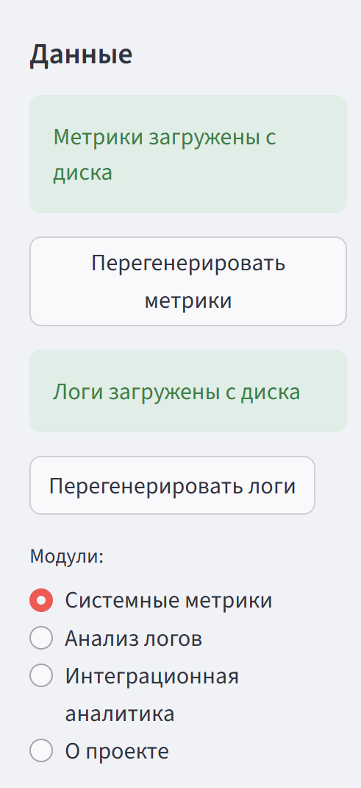
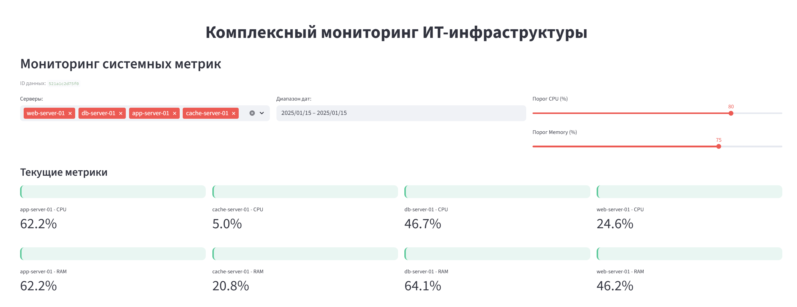
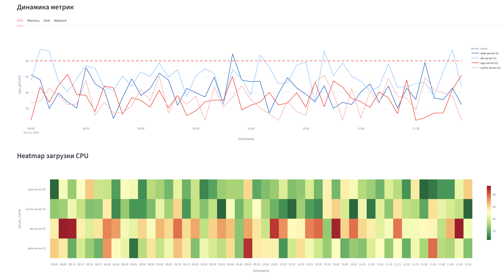
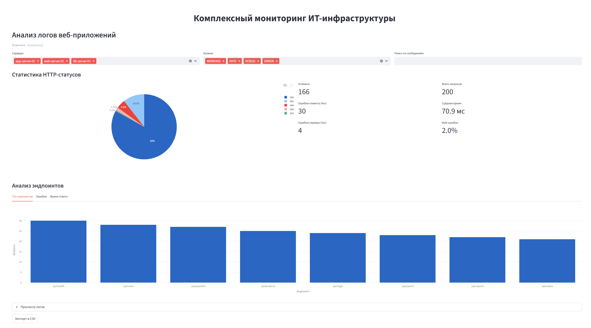
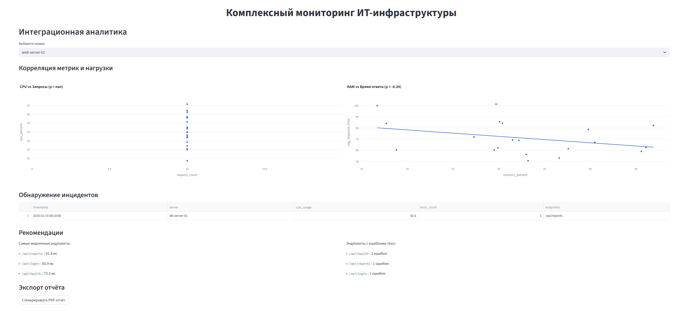
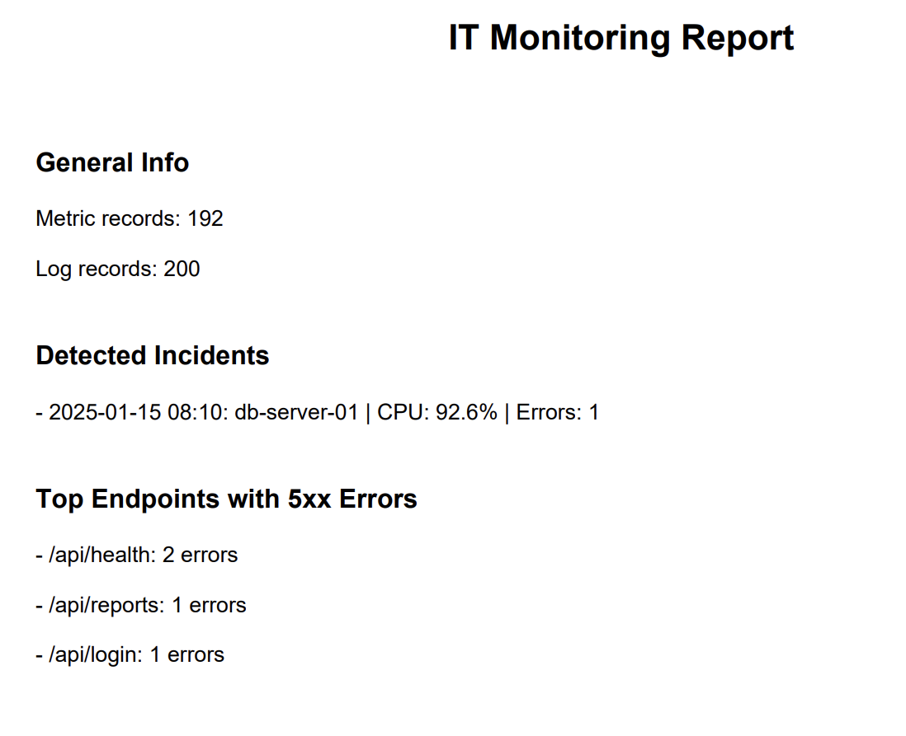

# Python_RK_3_IU8_BMSTU_2025
Вариант 5. 

## Инструкция по запуску

### 1. Установите зависимости

```text
pip install -r requirements.txt
```
### 2. Запустите приложение

```text
streamlit run main.py
```
---

## Формат входных данных

### `server_metrics.csv`

| Поле                 | Тип    | Описание                          |
|----------------------|--------|-----------------------------------|
| `timestamp`          | datetime | Временная метка                   |
| `server_name`        | str    | Имя сервера                       |
| `cpu_percent`        | float  | Загрузка CPU (%)                  |
| `memory_percent`     | float  | Использование RAM (%)             |
| `disk_usage_percent` | float  | Использование диска (%)           |
| `network_in_mbps`    | float  | Входящий трафик                   |
| `network_out_mbps`   | float  | Исходящий трафик                  |
| `status`             | str    | Статус: `healthy` / `warning` / `critical` |

---

### `web_app_logs.csv`

| Поле               | Тип    | Описание                          |
|--------------------|--------|-----------------------------------|
| `timestamp`        | datetime | Временная метка                   |
| `level`            | str    | Уровень лога: `INFO`, `WARNING`, `ERROR` |
| `server_name`      | str    | Имя сервера                       |
| `http_method`      | str    | HTTP-метод: `GET`, `POST`, `PUT`, `DELETE` |
| `endpoint`         | str    | API-эндпоинт                      |
| `http_status`      | int    | HTTP-код ответа                   |
| `response_time_ms` | int    | Время ответа (мс)                 |
| `message`          | str    | Сообщение лога                    |

---

## Структура

```text
project/
├── data/
│ ├── server_metrics.csv
│ ├── web_app_logs.csv
├── main.py
├── requirements.txt
└── fonts/
```
---

## Технические зависимости

### Основные требования

```text
streamlit>=1.28.0
pandas>=2.0.0
numpy>=1.24.0
plotly>=5.17.0
fpdf2>=2.7.0
```
---
## Функционал дашборда

### Данные

- **Автоматическая загрузка** тестовых данных (`server_metrics.csv`, `web_app_logs.csv`) с диска при запуске.
- **Ручная перегенерация** данных по кнопке - создаёт новые реалистичные CSV-файлы, сохраняя их на диск.

### Модули
1. **Системные метрики**  
   Показывает KPI (CPU, RAM, Disk, Network) по серверам с цветовой индикацией статуса. Включает графики динамики и heatmap загрузки CPU.

2. **Анализ логов**  
   Анализирует HTTP-статусы, топ эндпоинтов по частоте и времени ответа, позволяет фильтровать и искать логи. Экспорт в CSV.

3. **Интеграционная аналитика**  
   Выявляет корреляции между метриками и ошибками, обнаруживает инциденты (например, рост CPU + пик 5xx ошибок) и даёт рекомендации.

4. **О проекте**  
   Краткая информация о целях, технологиях и функционале приложения.

---

При обновлении страницы данные не теряются - они хранятся на диске и загружаются автоматически.
---

## Комплексный мониторинг ИТ-инфраструктуры

### Мониторинг системных метрик

Панель для отслеживания состояния серверов в реальном времени.

#### Настройки:
- **ID данных**: Уникальный идентификатор набора данных.
- **Серверы**: Выбор серверов для мониторинга.
- **Диапазон дат**: Фильтр по временному интервалу.
- **Пороги**: Настройка критических значений CPU (%) и Memory (%).

#### Текущие метрики:
Отображение актуальных показателей загрузки CPU и RAM для каждого выбранного сервера с цветовой индикацией состояния (зелёный - норма, красный - перегрузка).

## Динамика метрик

### График динамики CPU
Интерактивный линейный график, отображающий загрузку CPU (%) по каждому серверу в течение времени.

### Heatmap загрузки CPU
Тепловая карта, визуализирующая интенсивность загрузки CPU по серверам и времени.

## Анализ логов веб-приложений

Панель для диагностики производительности и стабильности API на основе логов.

### Фильтрация
- **Серверы**: Выбор серверов для анализа.
- **Уровни**: Фильтр по уровням логирования (WARNING, INFO, DEBUG, ERROR).
- **Поиск**: Поиск по тексту сообщений логов.

### Статистика HTTP-статусов
- **Круговая диаграмма** показывает распределение запросов по кодам ответа (2xx, 4xx, 5xx).
- **KPI-карточки** отображают

### Анализ эндпоинтов
- **Топ эндпоинтов**: График самых часто запрашиваемых эндпоинтов .
- Доступны вкладки для анализа **ошибок** и **времени ответа** по каждому эндпоинту.
- Возможность просмотра исходных логов и экспорта данных в CSV.

## Интеграционная аналитика

Модуль для выявления связей между системными метриками и нагрузкой на приложение.

### Корреляция метрик и нагрузки
- **Графики рассеяния** показывают зависимость:
  - CPU vs количество запросов
  - RAM vs среднее время ответа

### Обнаружение инцидентов
- Автоматический поиск совпадений

### Рекомендации
- **Самые медленные эндпоинты**: список с указанием времени ответа.
- **Эндпоинты с ошибками (5xx)**: перечисление эндпоинтов и количества ошибок.

### Экспорт отчёта

- Кнопка **«Сгенерировать PDF-отчёт»** - создает итоговый документ с данными.